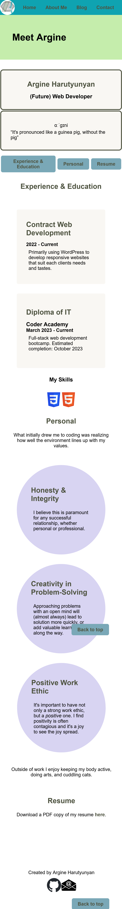

# T1A2 - My Portfolio
## Argine Harutyunyan

[Portfolio Website](https://portfolio-arharutyu.vercel.app/index.html)

[GitHub repository](https://github.com/arharutyu/t1a2)

[Presentation Video](https://youtu.be/Q0A_eDBu3NA)

---

### Purpose:
To provide a centralized location for information that will be relevant to my employment in the industry; and to convey this in a way that shows my positive & upbeat attitude to prospective employers.
### Target Audience:
Employers wanting to hire a web developer.

### Tech Stack:
HTML5, CSS3, deployment via Vercel

### Sitemap:

## Screenshots:

### Home page

**Functionality/Features**
* Navigation bar
    * Consistent across main pages
    * Provides easy links to all relevant pages
    * Hover effect (change background colour & italizised text) for easy navigation
    * Houses logo for recognition & visibility
* Header area
    * Welcome text
    * Can house graphics
* Content box
    * Formatted differently to regular text content for visual effect
* Button
    * Formatted hyperlinks for easy location & navigation
    * Hover effect (change background colour) for easy navigation

**Laptop View**

**Tablet View**

**Mobile View**

### About Me
**Functionality/Features**
* Navigation bar - *as above*
* Smaller header 
    * similar style to home page to maintain consistency, but adjusted to maximize screen space
* Internal page navigation via buttons
    * buttons formatted as per homepage
* Back to top floating button so all sections are easily accessible
* Various content boxes with different styling to keep the design interesting, and differentiate between each type of content area i.e. work, personal resume

**Laptop View**

**Tablet View**

**Mobile View**

### Contact
**Functionality/Features**
* Navigation bar - *as above*
* Smaller header - *as above*
* External link as required
* mailto: link for email

**Laptop View**

**Tablet View**

**Mobile View**

### Blog
**Functionality/Features**
* Navigation bar - *as above*
* Tablised list of blog posts for ease of navigation
* Semantically tagged datetime

**Laptop View**

**Tablet View**

**Mobile View**

### Blog Post 
**Functionality/Features**
* Anchor tags used to minimize new pages for each post
* Minimal design to prioritize ease of reading articles/ paragraphs of text
* Floating back to blog button to return to main site

**Laptop View**

**Tablet View**

**Mobile View**

